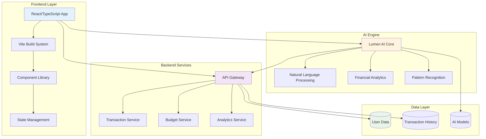
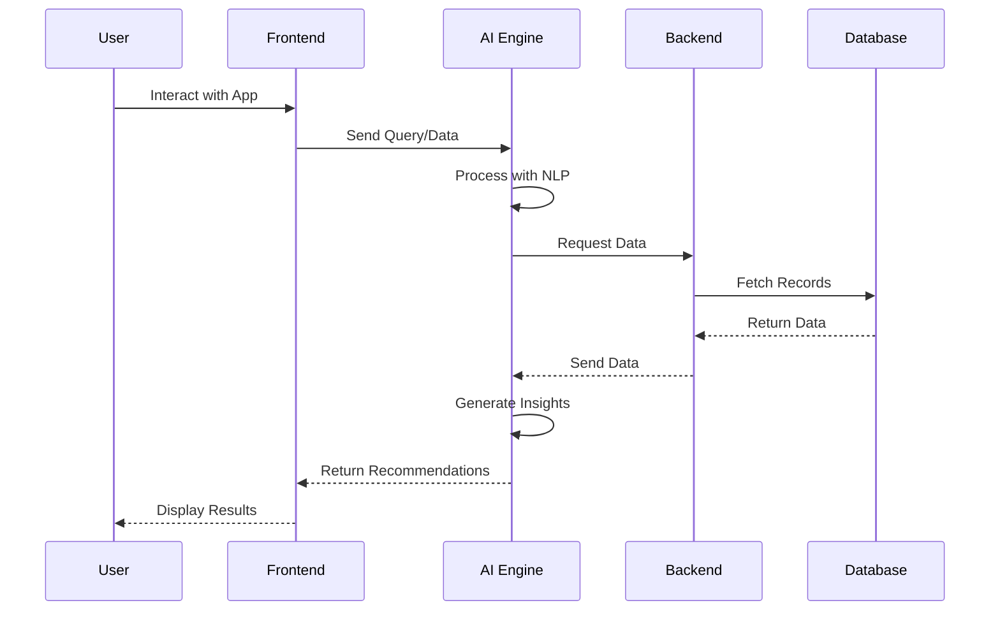

# 💰 Vincen-Dev - Lumen AI
**An AI-powered financial management application built for Hack-a-Sol 2025**

[](https://vincen-dev.vercel.app)
[](https://www.typescriptlang.org/)
[](https://developer.mozilla.org/en-US/docs/Web/CSS)
[](LICENSE)

---

## 📋 Table of Contents
- [🎯 About the Project](#-about-the-project)
- [✨ Key Features](#-key-features)
- [🏗️ System Architecture](#️-system-architecture)
- [🚀 Getting Started](#-getting-started)
- [💻 Usage Guide](#-usage-guide)
- [🛠️ Tech Stack](#️-tech-stack)
- [📱 Screenshots](#-screenshots)
- [🤝 Contributing](#-contributing)
- [👥 Team](#-team)

---

## 🎯 About the Project

**Lumen AI** is a modern B2C financial management application designed to help users take control of their finances with the power of AI. Built as part of the **Hack-a-Sol AI Track**, this application combines cutting-edge technology with intuitive design to deliver a seamless financial experience.

### 🎓 Hackathon Context
- **Event:** Hack-a-Sol 2025
- **Track:** AI Innovation Track  
- **Challenge:** Build an AI-powered solution for real-world financial management
- **Goal:** Democratize financial planning through intelligent automation

### 🌟 Why Vincen-Dev?
Modern consumers need more than just banking apps—they need intelligent financial partners. Vincen-Dev bridges the gap between complex financial data and actionable insights, making money management accessible to everyone.

---

## ✨ Key Features

### 💡 Core Capabilities

| Feature | Description | Status |
|---------|-------------|--------|
| 🤖 **AI Financial Assistant** | Smart recommendations based on spending patterns | ✅ Active |
| 📊 **Expense Tracking** | Real-time monitoring of income and expenses | ✅ Active |
| 📈 **Budget Planning** | Intelligent budget suggestions and alerts | ✅ Active |
| 🎯 **Goal Setting** | Track financial goals with progress visualization | ✅ Active |
| 📱 **Responsive Design** | Works seamlessly on mobile, tablet, and desktop | ✅ Active |
| 🔒 **Secure** | Enterprise-grade security for your financial data | ✅ Active |

### 🚀 AI-Powered Features
- **Smart Spending Analysis**: Automatically categorizes and analyzes your transactions
- **Predictive Insights**: Forecasts future expenses based on historical data
- **Personalized Recommendations**: Tailored saving strategies and investment tips
- **Anomaly Detection**: Alerts for unusual spending patterns
- **Natural Language Queries**: Ask questions about your finances in plain English

---

## 🏗️ System Architecture



### 🔄 Data Flow



---

## 🚀 Getting Started

### Prerequisites
Ensure you have the following installed:
- **Node.js** 16.x or higher
- **npm** 8.x or higher (comes with Node.js)
- **Git** for version control

### Installation

1. **Clone the repository**
   ```bash
   git clone -b Brain https://github.com/VinayakNPN/Vincen-Dev.git
   cd Vincen-Dev
   ```

2. **Install dependencies**
   ```bash
   npm install
   ```

3. **Set up environment variables**
   ```bash
   # Create .env file in the root directory
   touch .env
   
   # Add your configuration
   echo "VITE_API_URL=your_api_url" >> .env
   echo "VITE_AI_KEY=your_ai_key" >> .env
   ```

4. **Start the development server**
   ```bash
   npm run dev
   ```

5. **Open your browser**
   Navigate to `http://localhost:5173` (or the port shown in terminal)

### 🏗️ Build for Production
```bash
# Create optimized production build
npm run build

# Preview production build locally
npm run preview
```

---

## 💻 Usage Guide

### 🎯 Quick Start Tutorial

**Step 1: Dashboard Overview**
```typescript
// Navigate to dashboard after login
// View your financial summary at a glance
```


**Step 2: Add Transactions**
```typescript
// Click "Add Transaction" button
// Fill in amount, category, and description
// AI automatically categorizes similar future transactions
```

**Step 3: Ask AI Assistant**
```typescript
// Use the AI chat interface
const query = "How much did I spend on dining last month?";
// Get instant, intelligent responses
```

### 🤖 AI Assistant Examples

**Analyze Spending**
```
You: "Show me my biggest expenses this month"
AI: "Your top 3 expenses are:
     1. Rent: $1,500
     2. Groceries: $450
     3. Utilities: $200
     Would you like tips to reduce any of these?"
```

**Budget Recommendations**
```
You: "Help me save $500 next month"
AI: "Based on your spending patterns, here's a plan:
     - Reduce dining out by $200 (from $400 to $200)
     - Cut entertainment by $150 (from $300 to $150)
     - Lower shopping by $150 (from $400 to $250)
     This achieves your $500 saving goal!"
```

**Financial Goals**
```
You: "Track my vacation fund goal"
AI: "Creating vacation fund tracker...
     Goal: $3,000
     Current: $750 (25% complete)
     Monthly target: $375
     Estimated completion: 6 months"
```

---

## 🛠️ Tech Stack

### Frontend Technologies
```typescript
{
  "framework": "React 18",
  "language": "TypeScript 5.0",
  "buildTool": "Vite 4.0",
  "styling": "CSS Modules",
  "stateManagement": "React Context/Hooks"
}
```

### Project Structure
```
Vincen-Dev/
├── 📂 src/                    # Source code
│   ├── 📂 components/         # React components
│   ├── 📂 pages/              # Page components
│   ├── 📂 hooks/              # Custom React hooks
│   ├── 📂 utils/              # Utility functions
│   ├── 📂 types/              # TypeScript types
│   └── 📂 styles/             # Global styles
├── 📂 lumen-ai/               # AI engine module
│   ├── 📄 core.ts             # AI core logic
│   ├── 📄 nlp.ts              # Natural language processing
│   └── 📄 analytics.ts        # Financial analytics
├── 📄 index.html              # Entry HTML
├── 📄 vite.config.ts          # Vite configuration
├── 📄 package.json            # Dependencies
└── 📄 README.md               # Documentation
```

### 🔧 Key Dependencies
| Package | Purpose | Version |
|---------|---------|---------|
| `react` | UI framework | ^18.x |
| `typescript` | Type safety | ^5.x |
| `vite` | Build tool | ^4.x |
| `react-router-dom` | Routing | ^6.x |

---

## 📱 Screenshots

### 🏠 Home Dashboard

*Clean, intuitive dashboard showing your financial overview*

### 💳 Transaction View

*Detailed transaction history with smart categorization*

### 🤖 AI Assistant Chat

*Natural language interface for financial queries*

### 📊 Analytics Dashboard

*Visual insights into your spending patterns*

### 🎯 Goal Tracking

*Track and achieve your financial objectives*

---

## 🎨 Design Philosophy

### Color Palette
```css
:root {
  --primary-blue: #2563eb;
  --success-green: #10b981;
  --warning-orange: #f59e0b;
  --danger-red: #ef4444;
  --neutral-gray: #6b7280;
}
```

### Design Principles
- ✨ **Simplicity First**: Clean, uncluttered interface
- 🎯 **User-Centric**: Every feature serves a clear purpose
- 📱 **Mobile-First**: Responsive design for all devices
- ♿ **Accessible**: WCAG 2.1 AA compliant
- 🚀 **Performance**: Optimized for speed and efficiency

---

## 🧪 Development

### Running Tests
```bash
# Run unit tests
npm run test

# Run tests in watch mode
npm run test:watch

# Generate coverage report
npm run test:coverage
```

### Code Quality
```bash
# Lint code
npm run lint

# Format code
npm run format

# Type check
npm run type-check
```

### Development Tips
- 🔥 Hot reload is enabled by default
- 🛠️ Use TypeScript for type safety
- 📝 Follow the existing code style
- ✅ Write tests for new features
- 📚 Update documentation as needed

---

## 🤝 Contributing

We welcome contributions from the community! Here's how you can help:

### 🌟 Ways to Contribute
- 🐛 Report bugs and issues
- 💡 Suggest new features
- 📝 Improve documentation
- 🔧 Submit pull requests
- ⭐ Star the repository

### 📋 Contribution Guidelines

1. **Fork the repository**
2. **Create a feature branch**
   ```bash
   git checkout -b feature/amazing-feature
   ```
3. **Make your changes**
   - Write clean, well-documented code
   - Follow existing code style
   - Add tests if applicable
4. **Commit your changes**
   ```bash
   git commit -m "Add amazing feature"
   ```
5. **Push to your fork**
   ```bash
   git push origin feature/amazing-feature
   ```
6. **Open a Pull Request**

### 💬 Code of Conduct
- Be respectful and inclusive
- Welcome newcomers and beginners
- Focus on constructive feedback
- Help each other learn and grow

---

## 👥 Team

**Project Lead & Developer**
- [VinayakNPN](https://github.com/VinayakNPN) - *Lead Developer*
- [yashjain0099](https://github.com/yashjain0099) - *Developer*
- 

### 🙏 Acknowledgments
- Hack-a-Sol organizers for the opportunity
- The open-source community for inspiration
- All contributors and supporters

---

## 📄 License

This project is licensed under the MIT License - see the [LICENSE](LICENSE) file for details.

```
MIT License

Copyright (c) 2024 VinayakNPN

Permission is hereby granted, free of charge, to any person obtaining a copy
of this software and associated documentation files (the "Software"), to deal
in the Software without restriction...
```

---

## 🔗 Links & Resources

### 📚 Documentation
- [API Documentation](docs/API.md)
- [Component Guide](docs/COMPONENTS.md)
- [Deployment Guide](docs/DEPLOYMENT.md)

### 🌐 External Links
- [Figma Design](https://www.figma.com/design/NslMUMXDRL5TZaZww5udlP/B2C-Financial-App-Prototype)
- [Project Website](https://vincen-dev.vercel.app)
- [GitHub Issues](https://github.com/VinayakNPN/Vincen-Dev/issues)

### 🎓 Learning Resources
- [React Documentation](https://react.dev)
- [TypeScript Handbook](https://www.typescriptlang.org/docs/)
- [Vite Guide](https://vitejs.dev/guide/)

---

## 📊 Project Stats


---

## 💖 Support

If you find this project helpful:
- ⭐ **Star** the repository
- 🐛 **Report** issues you encounter
- 💡 **Suggest** new features
- 📢 **Share** with your network
- 🤝 **Contribute** to the codebase

---

## 📞 Contact

Have questions or suggestions? Reach out!

- 🐙 **GitHub**: [@VinayakNPN](https://github.com/VinayakNPN)
                  [@yashjain0099](https://github.com/yashjain0099) 
- 
- 📧 **Email**: Open an issue for inquiries
- 💬 **Discussions**: Use GitHub Discussions for Q&A

---

**Built with 💙 for Hack-a-Sol 2024 | Making Financial Management Intelligent and Accessible**

*Ready to take control of your finances? Clone the repo and start your journey today!* 🚀
